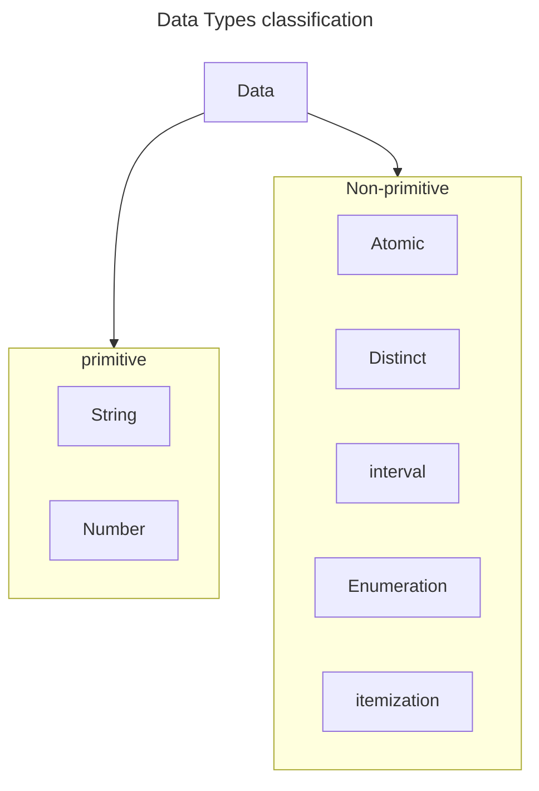

[[How to design data definition]]

```
;; Part of a traffic simulation

(define (next-color c)
    (cond [(= c 0) 2]
          [(= c 1) 0]
          [(= c 2) 1]))
```

#### Above function does not tell much about the function .

```
;; Part of a traffic simulation

;; Natural -> Natural
;; Produces the next color in the traffic

(check-expect (next-color 0) 2)
(check-expect (next-color 1) 0)
(check-expect (next-color 2) 1)

;(define (next-color c)0)           ; stub
;(define (next-color c)
;           (...c))                 ; template

  
(define (next-color c)
    (cond [(= c 0) 2]
          [(= c 1) 0]
          [(= c 2) 1]))
```

#### Above is the function definition with How to design function recipe.
Here it look more readable.

But here is a little problem too. Function definition states that it consumes **Natural** number  and produces **Natural** number, but we can observe it 
consumes on of [0,1,2] and produces in same range.


![[Pasted image 20250305192632.png|700]]


 - ### Note: data definition will describe how we are representing information as data
```
  

;; Data definitions:

;; TLColor is one of:
;; - 0
;; - 1
;; - 2
;; interp. 0 is red, 1 is yellow, 2 is green

#;
(define (fn-for-tlcolor c)
  (cond [(= c 0) (...)]
        [(= c 1) (...)]
        [(= c 2) (...)]))

  
;; Funtion
;; TLColor -> TLColor
;; Produces the next color in the traffic

(check-expect (next-color 0) 2)
(check-expect (next-color 1) 0)
(check-expect (next-color 2) 1)

;(define (next-color c)0)           ; stub

;(define (next-color c)
;           (...c))                 ; template

(define (next-color c)
    (cond [(= c 0) 2]
          [(= c 1) 0]
          [(= c 2) 1]))
```

### Data definition describe:
- How to form data of a new type
- How to represent information as data
- How to interpret data as information
- template for operating on data

#### [A data definition consists of four or five elements:](https://courses.edx.org/courses/course-v1:UBCx+SPD1x+2T2015/77860a93562d40bda45e452ea064998b/?_gl=1*1qvyjwn*_gcl_au*MjA5MjE3OTMwMC4xNzM0NTIwNzg5*_ga*MTYwOTgwMTkzNS4xNzM0NTIwNzg4*_ga_D3KS4KMDT0*MTc0MTE4Mzc1MS42LjEuMTc0MTE4Mzc1NC41Ny4wLjA.#HtDD)

1. A possible **structure definition** (not until compound data)
2. A **type comment** that defines a new type name and describes how to form data of that type.
3. An **interpretation** that describes the correspondence between information and data.
4. One or more **examples** of the data.
5. A **template** for a 1 argument function operating on data of this type.
![[Pasted image 20250305195041.png|]]

### For a given type TypeName the data driven template is:

```
(define (fn-for-type-name x)
  <body>)
```


>[!question]
>#question
>![[Pasted image 20250305194155.png]]


> [!done] Solution
> ```
> ;; CityName is  Stirng                                 // type comment
> ;; interp. the name of a city                       // interpretation
> 
>(define C1 "Mumbai")
>(define C2 "Dehli")                                    // Examples
>
>#;
>(define (fn-for-city-name cn)                     // Template
>      (... cn))
>
>;; Template rules used: 
>;;         -atomic non-distinct: String 

>[!question]
>#question
>![[Pasted image 20250306211437.png]]

 >[!success] Solution
 >```
 >;; Data definitions: 
 >
 > ;; CityName is  Stirng                                 ; type comment
> ;; interp. the name of a city                        ;interpretation
> 
>(define C1 "Mumbai")
>(define C2 "Dehli")                                    ; Examples
>
>#;
>(define (fn-for-city-name cn)                     ;Template
>      (... cn))
>      
>;; Template rules used: 
>;;         -atomic non-distinct: String 
>
>;;Funtioins:
>
>;; CityName -> Boolean
>;; Produces true if city is best in the world
>
(check-expect (best-city? "Dehli")false)
(check-expect (best-city? "Jabalpur")true)
>
>;(define (best-city? cn)false)                   ; stub
>
>; took templatae form CityName:
>
>(define (best-city? cn)                     
>      (string=? cn "Jabalpur"))
>```





## Interval
Use an interval when the information to be represented is numbers within a certain range. 
		
**Example:**
   Integer[0, 10]

>[!question]-
>#question
>![[Pasted image 20250306225048.png]]
>>[!done] Solution
>>```
>>;; SeatNumber is Natural[1,32]
>>;; interp. a seat number in a row, 1 and 32 are aisle seat
>>
>>(define SN1 1)                ; aisle
>>(define SN2 7)                ; middle
>>(define SN3 32)              ; aisle
>>
>>#;
>>(define (fn-for-seat-number cn)                  ; Template
>>	(... cn))
>>
>>; Templates rules used: 
>>;		- atomic non-distinct: Natural[1,32]
>>```

## Enumeration 
data definitions are used when the information to be represented consists of two or more distinct values.

  >[!question]
  >![[Pasted image 20250307105632.png]]


> [!question]$- 
> #question
> ![[Pasted image 20250306225048.png]]
>> [!done] Solution
>> ;; SeatNumber is Natural[1,32]
>> ;; interp. a seat number in a row, 1 and 32 are aisle seat
>> 
>> (define SN1 1)                ; aisle
>> (define SN2 7)                ; middle
>> (define SN3 32)              ; aisle
>> 
>> #;
>> (define (fn-for-seat-number cn)                  ; Template
>>   (... cn))
>> 
>> ; Templates rules used:
>> ;          - atomic non-distinct: Natural[1,32]
